# ALPHA_BENCHMARK_V1

Controlled synthetic evaluation of TADR Core Alpha / Check Set A.

Frozen release: 2026-09-09.

**ORIGINAL PREREGISTERED-LABEL RESULT: whole-cell normative conformance 234/320 (73.1250%).**

**ADJUDICATED PINNED-CONTRACT RESULT: whole-cell normative conformance 320/320 (100.0000%).**

**Physical detection: 246/314 (78.3439%); 68 physical misses remain.** Pinned-contract conformance is a different metric and does not replace physical detection.

## Scientific history and provenance

Original physical/design ground truth and preregistered normative labels preceded execution. Normative adjudication occurred after execution and derives from the pre-existing Algorithm 1.0 contract. No target execution changed; physical truth and scientific inputs did not change; canonical reports, attempts, instrumentation and diagnostics were unchanged. The original 234/320 label result is retained as historical scientific-design evidence, not overwritten.

| Provenance role | Binding |
| --- | --- |
| Scientific execution | a76bb9458b181500c7bfb9efefcfecfbb019b5a9 |
| Historical processing/aggregation | 4887bd579d394de523bab0ccb227840d66447fd9 |
| Publication assembly | 39c49812fbc817d62108a7e4262066894d35c10c |
| Target | tadr-core 0.1.0; Algorithm 1.0; MVP_V1; AnalysisBundle 1.0; baseline 1.0.12 |
| Proprietary installation artifact SHA-256 | a37ec8d336d16dbe4b7a7448071808daaf5e3e0ab03afe3bb7de0ce6882bc31d |

See [execution provenance](execution_provenance.json), [historical processing provenance](processing_provenance.json), [publication provenance](publication_provenance.json), [execution environment](environment.json) and [publication inventory](publication_inventory.json). The READY manifest under history is the original launch declaration; its NOT YET RUN notes do not describe this completed experiment.

The evaluated tadr-core implementation is proprietary. This repository distributes neither Core source nor private wheel bytes. Re-execution and independent semantic inspection of the implementation require authorized artifact access. Public generators, recipes, ground truth and dataset identities support regeneration; generated source CSV/Parquet files are excluded from this release. Source-level rebuilding of proprietary Core from public artifacts is unavailable.

## Original and adjudicated annotations

The supplemental overlay records 18 category-cap annotation defects and 68 event_key normative-frame disagreements. Category caps follow the existing weighted-severity/confidence scoring rule. The event name heuristic treats event_key as a datetime candidate. The correction adds normative check/subject opportunities without changing physical truth or primary-clean membership.

| Metric | Original | Adjudicated |
| --- | --- | --- |
| Whole-cell normative conformance | 234/320 (73.1250%) | 320/320 (100.0000%) |
| Category-cap annotation correctness | 302/320 (94.3750%) | 320/320 (100.0000%) |
| Hard-gate correctness | 320/320 (100.0000%) | 320/320 (100.0000%) |
| Suppression | 8/8 (100.0000%) | 8/8 (100.0000%) |
| INFO normative opportunity coverage | 9106/9106 (100.0000%) | 9174/9174 (100.0000%) |

Inspect [all old/corrected annotations and metric effects](adjudication_v1/adjudication.json), [corrected normative labels](adjudication_v1/corrected_normative_annotations.json), [adjudicated scenario metrics](adjudication_v1/adjudicated_scenario_metrics.json), [original/adjudicated summary](adjudication_v1/summary.json), [adjudicated scenario table](adjudication_v1/tables/adjudicated_scenario_matrix.csv), [adjudicated detection table](adjudication_v1/tables/adjudicated_detection_by_check.csv), [contract basis](adjudication_v1/contract_basis.json) and [evidence preservation](adjudication_v1/evidence_preservation.json).

Root expectations.json, runs.jsonl detection fields, summary.json, tables and figures retain the ORIGINAL PREREGISTERED-LABEL RESULT. They must not be described as adjudicated values. The [original candidate report](history/candidate_REPORT.md), [READY manifest](history/ready_manifest.json), [original checksum manifest](history/candidate_checksums.sha256) and [original scientific review](history/ALPHA_BENCHMARK_V1_SCIENTIFIC_RESULT_REVIEW.md) preserve historical content. Their old banners and relative links are archival; the [reproduction note](ADJUDICATION_REPRODUCTION.md) supplies the current path mapping.

## Principal adverse findings

**Physical sensitivity remains 246/314 (78.3439%), with 68 physical misses.** Below-threshold, support/collapse, nonreciprocal leakage, allowlisting and split-policy cases retain their original strata. The shared entity condition remains one physical opportunity; normative detector identity and suppression remain separate.

**Adverse event_key specificity: 68 representation cells / 34 logical pairs.** Valid `event_<integer>` identifiers triggered HIGH schema.parse_failures::column:event_key warnings. These are normatively expected by the pinned Alpha heuristic and practically adverse specificity behavior, not malformed physical datetime values or a favorable result. The isolated 10.04 schema penalty gives quiet keyed/group cases readiness 90 and report confidence 81; absolute family scores include that background. [All original event_key Findings and scores](adjudication_v1/practical_event_key.json) remain visible. None of these cells is added post hoc to primary-clean FPR. Primary-clean false-positive rate remains 0/226 for the eight preregistered controls; that narrow result does not establish general absence of unwanted warnings.

**Sampling: 28/36 reference/bounded Finding sets agree exactly; 8 disagree.** The deterministic HEAD_STRIDE_V1 geometry can miss conditions or change threshold eligibility. Exact repetition can repeat the same blind spot.

| Disagreeing sampling cell | Readiness full → bounded | Findings/gates retained as observed |
| --- | --- | --- |
| sampling.cardinality.head.n300000.pqstr | 97 → 100 | See original paired reports and diagnostics; no underlying data improvement is inferred. |
| sampling.class_boundary.middle.n300000.pqstr | 100 → 92 | See original paired reports and diagnostics; no underlying data improvement is inferred. |
| sampling.class_boundary.tail.n300000.pqstr | 100 → 92 | See original paired reports and diagnostics; no underlying data improvement is inferred. |
| sampling.class_rare.gaps.n300000.pqstr | 83 → 100 | See original paired reports and diagnostics; no underlying data improvement is inferred. |
| sampling.duplicate_keys.gaps.n300000.pqstr | 73 → 90 | See original paired reports and diagnostics; no underlying data improvement is inferred. |
| sampling.duplicate_rows.gaps.n300000.pqstr | 90 → 100 | See original paired reports and diagnostics; no underlying data improvement is inferred. |
| sampling.group.gaps.n300000.pqstr | 79 → 90 | See original paired reports and diagnostics; no underlying data improvement is inferred. |
| sampling.leakage.head.n300000.pqstr | 60 → 100 | CRITICAL leakage Finding disappears; hard gate disappears. This is a negative sampling result. |

The leakage head case's **60 → 100** change is not improved data quality. See [sampling fidelity](tables/sampling_fidelity.csv) and [diagnostic primitives](tables/sampling_primitives.csv).

**Strict format comparison: 42 mismatches — 37 CSV/pqstr and 5 native projections.** Decision fields remained equal across these mismatches: yes. Empty-token/typed-null and typed string-statistic differences affect dataset_profile. Findings, readiness, risks, confidence, gates/caps, analysis_stats and remediation retain the observed agreement. The [preregistered strict comparison](tables/format_equivalence.csv) is not replaced by a post hoc normalized metric.

**Scoring limitations:** numeric parser corruption 2000/10000 gives readiness 89 and Finding confidence .70; 4000/10000 gives readiness 90 and confidence .62; 6000/10000 loses numeric dominance and gives readiness 100. This is parser/scoring non-monotonicity. A collapsed class can escape the diversity-dependent imbalance check. Readiness and confidence are not calibrated damage or safety measures. Remediation gains are heuristic estimates, not measured causal recovery or downstream model improvement.

## Supported positive observations and exact scope

- 578/578 successful selected primary reports; 0 retries, 0 resolved infrastructure failures and 0 terminal failures, including timeouts/resource aborts.
- 72/72 retained diagnostics.
- Adjudicated expected Finding matches: 320/320; severity matches: 320/320.
- Hard-gate correctness: 320/320 (100.0000%); suppression: 8/8 (100.0000%).
- Primary clean controls with zero Findings: 8/8.
- Selected context/repeat pairs byte-identical: 72/72; declared determinism comparisons matching: 159/159.

Singleton groups are **not repeat-tested**. Historical summary booleans denote within-group equality and do not demonstrate repeatability for one observation. These positive findings apply only to this constructed corpus, its declared contexts/repeats and scientific environment. They do not establish real-world accuracy, unbiased population estimates, calibration, production safety, regulatory suitability, downstream model quality or state-of-the-art performance.

## Performance and measurement limits

Execution used Ubuntu 24.04 under WSL2, Linux x86_64, Python 3.11.9, four Polars threads and native ext4 storage. Results are WSL2-specific; native-Linux equivalence is not claimed. Filesystem cache was recently prepared/uncontrolled, not cold-cache. Runtime brackets public analysis only, with generation/startup/serialization/evaluation outside the bracket. Sampled RSS sums the worker tree, excludes the supervisor, includes worker baseline memory and can miss short-lived peaks. It is not the true continuous peak or a hard memory guarantee.

Requested RSS interval: 0.01 seconds. Actual maximum observed gap: 0.105340397 seconds. Per-run counts, gaps, completion and context acknowledgements remain in [instrumentation.jsonl](instrumentation.jsonl). Warmups remain in runs.jsonl and are excluded from measured aggregates.

| Scale cell | Measured n | Original seconds, repeat order | Median s | Range s | Evidence |
| --- | --- | --- | --- | --- | --- |
| scale.analytics.n10000.w20.csv | 3 | [4.964951528, 5.017880281, 4.952948122] | 4.964951528 | 4.952948122–5.017880281 | descriptive repeated measurements |
| scale.analytics.n10000.w20.pqnative | 3 | [4.193529586, 4.176850961, 4.235339492] | 4.193529586 | 4.176850961–4.235339492 | descriptive repeated measurements |
| scale.analytics.n10000.w300.csv | 3 | [175.339613123, 175.137811229, 172.723412027] | 175.137811229 | 172.723412027–175.339613123 | descriptive repeated measurements |
| scale.analytics.n10000.w300.pqnative | 3 | [75.645909787, 75.799652089, 74.52863115] | 75.645909787 | 74.52863115–75.799652089 | descriptive repeated measurements |
| scale.analytics.n100000.w100.csv | 3 | [355.744073543, 352.520049262, 351.8703182] | 352.520049262 | 351.8703182–355.744073543 | descriptive repeated measurements |
| scale.analytics.n100000.w100.pqnative | 3 | [240.476081163, 237.36548183, 239.105272599] | 239.105272599 | 237.36548183–240.476081163 | descriptive repeated measurements |
| scale.analytics.n100000.w20.csv | 3 | [52.992867966, 53.377463648, 53.174762302] | 53.174762302 | 52.992867966–53.377463648 | descriptive repeated measurements |
| scale.analytics.n100000.w20.pqnative | 3 | [45.051862231, 44.932108543, 44.845552261] | 44.932108543 | 44.845552261–45.051862231 | descriptive repeated measurements |
| scale.analytics.n1000000.w100.pqnative | 3 | [1135.465676025, 1148.830717559, 1170.992523595] | 1148.830717559 | 1135.465676025–1170.992523595 | descriptive repeated measurements |
| scale.analytics.n1000000.w20.csv | 3 | [266.691350568, 269.661744015, 269.927543232] | 269.661744015 | 266.691350568–269.927543232 | descriptive repeated measurements |
| scale.analytics.n1000000.w20.pqnative | 3 | [225.793290073, 228.086224712, 220.240987367] | 225.793290073 | 220.240987367–228.086224712 | descriptive repeated measurements |
| scale.analytics.n5000000.w20.pqnative | 2 | [914.052132966, 910.409173628] | 912.230653297 | 910.409173628–914.052132966 | n=2 weak descriptive evidence; two-point MAD is not interpreted |
| scale.regression.n100000.w20.pqnative | 3 | [64.337043171, 63.935079124, 63.385097398] | 63.935079124 | 63.385097398–64.337043171 | descriptive repeated measurements |
| scale.regression.n1000000.w20.pqnative | 3 | [330.239251274, 324.771727496, 322.802164018] | 324.771727496 | 322.802164018–330.239251274 | descriptive repeated measurements |

The 5M case has **n=2 weak descriptive evidence**, zero warmups and both raw measurements retained. Small repeat counts do not support inferential performance claims. Fixed sampled population does not remove full-scan/source costs; cross-mode throughput is not an equal-work speedup. [Original scale table](tables/scale_performance.csv) retains all metrics.

## Artifact queries, figures and reproduction

All original tables and SVG bytes are preserved. Figure regeneration uses selected outcomes ordered by stable attempt_id, including tied x-values; this changes neither scientific execution order nor canonical RunSpec/run serialization. The figures depict original-label queries; the adjudicated tables above remain a separate layer. [Original summary](summary.json) and [summary table](tables/summary.csv) retain original aggregation.

- [clean_false_positives.csv](tables/clean_false_positives.csv)
- [composite_interactions.csv](tables/composite_interactions.csv)
- [detection_by_check.csv](tables/detection_by_check.csv)
- [determinism.csv](tables/determinism.csv)
- [failures.csv](tables/failures.csv)
- [format_equivalence.csv](tables/format_equivalence.csv)
- [identity.csv](tables/identity.csv)
- [mismatch_paths.csv](tables/mismatch_paths.csv)
- [remediation.csv](tables/remediation.csv)
- [sampling_fidelity.csv](tables/sampling_fidelity.csv)
- [sampling_primitives.csv](tables/sampling_primitives.csv)
- [scale_performance.csv](tables/scale_performance.csv)
- [scenario_matrix.csv](tables/scenario_matrix.csv)
- [score_sweeps.csv](tables/score_sweeps.csv)
- [threshold_boundaries.csv](tables/threshold_boundaries.csv)

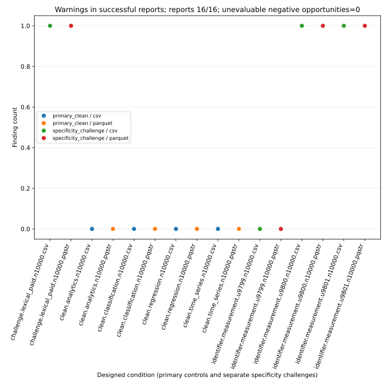
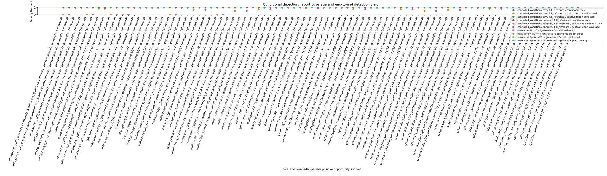
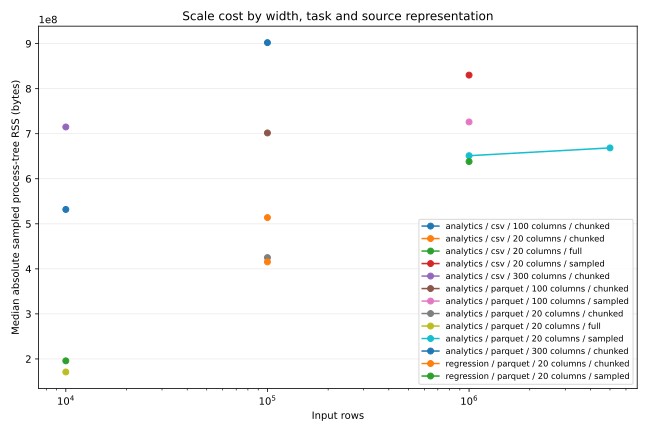
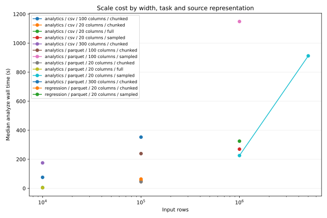
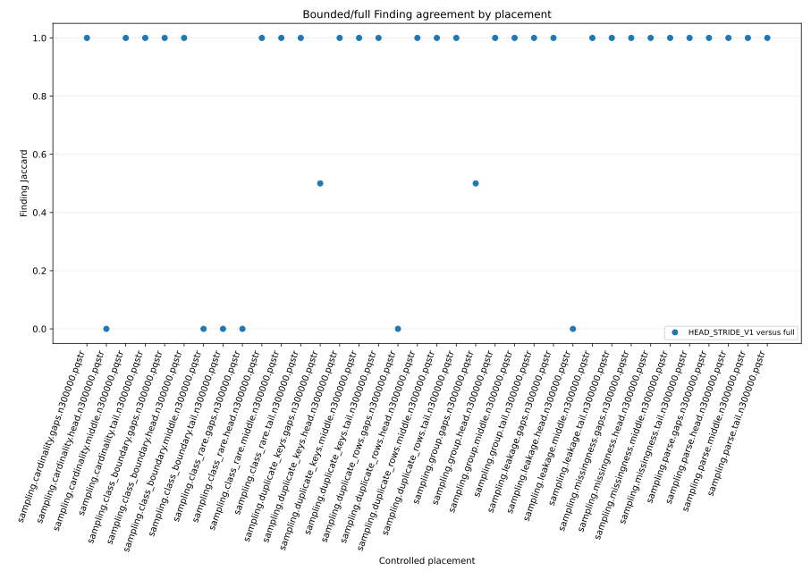
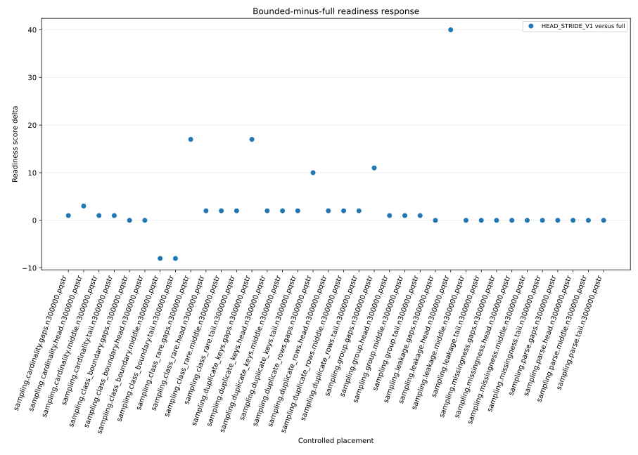
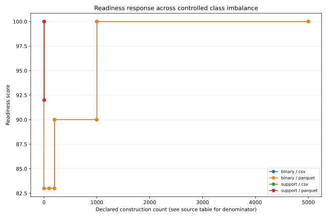
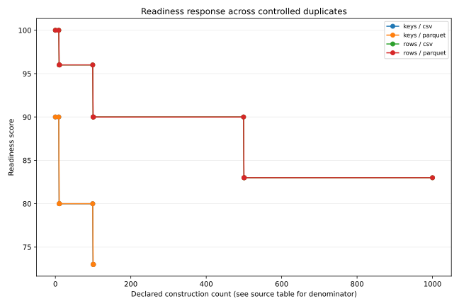
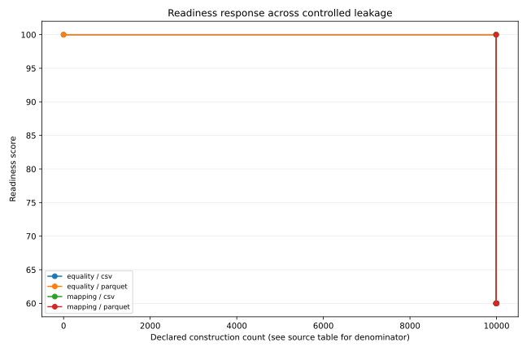
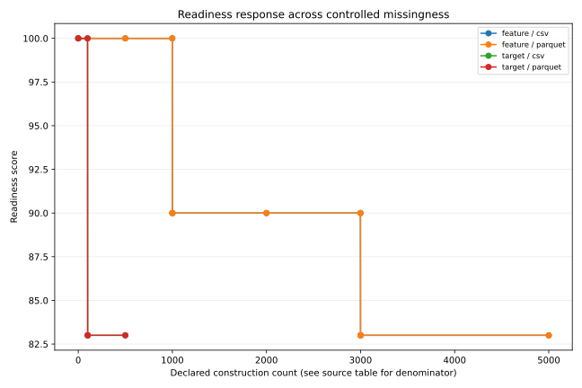
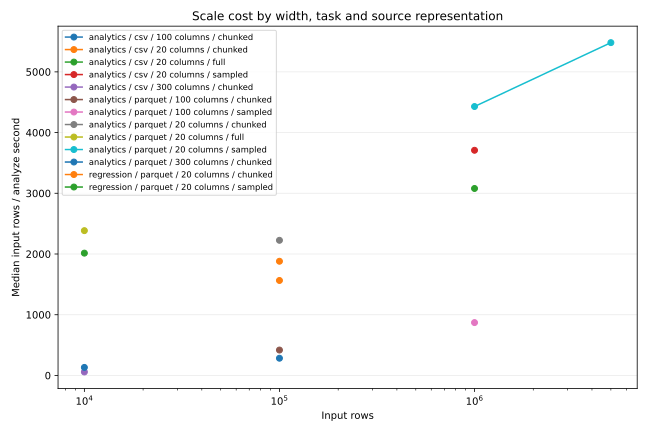

Verify the complete outer [checksums](checksums.sha256), original-candidate archive mapping and [adjudication inner checksums](adjudication_v1/checksums.sha256). [ADJUDICATION_REPRODUCTION.md](ADJUDICATION_REPRODUCTION.md) explains public input reconstruction, script hashes, historical Windows annotation processing and the proprietary target boundary. Publication provenance is separate from both historical revisions; no fictitious commit is assigned to operator scripts.
